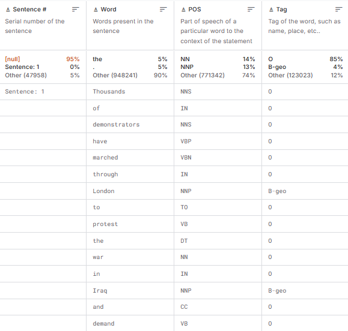

**Identitas**  
Nama : Dzikri Muhammad Raditya Putra
NIM : 18221144

**Task**  
Task: Named-Entity Recognition

Deskripsi Task
mengidentifikasi dan mengklasifikasikan entitas-entitas penting dalam sebuah teks ke dalam kategori yang telah ditentukan

**Dataset**
Nama Dataset: Dataset Card for Poetry
Link Asli Dataset: https://www.kaggle.com/datasets/debasisdotcom/name-entity-recognition-ner-dataset?resource=download

Statistik Dataset:
Jumlah data : 1M
Fitur / kolom : 4 kolom (Sentence, Word, POS, Tag)
Tipe data : Tabular

Contoh dataset

